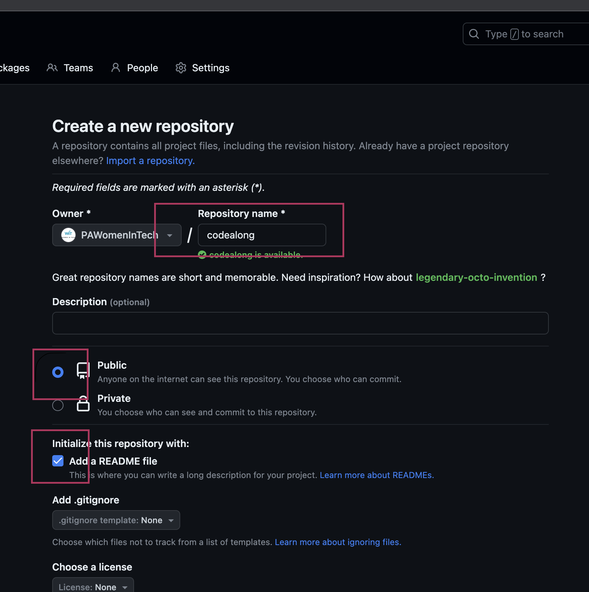
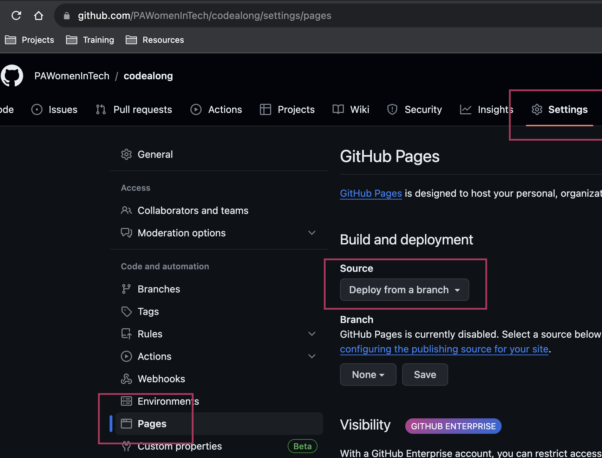
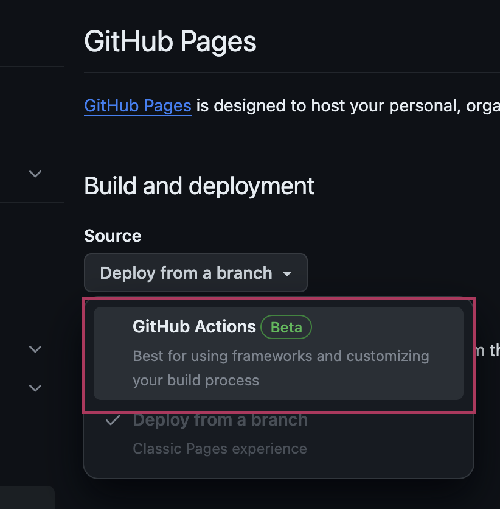
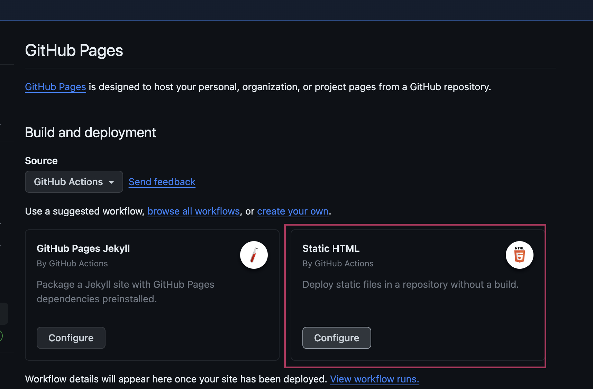
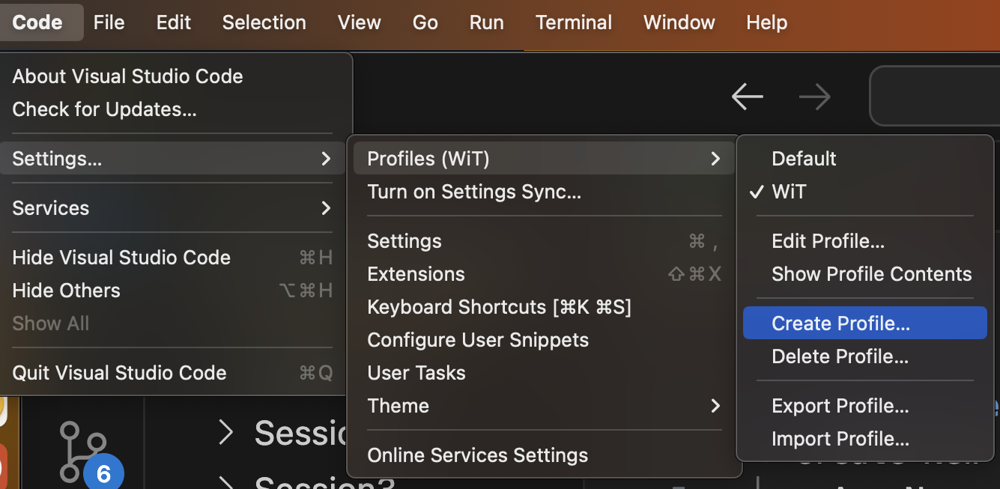
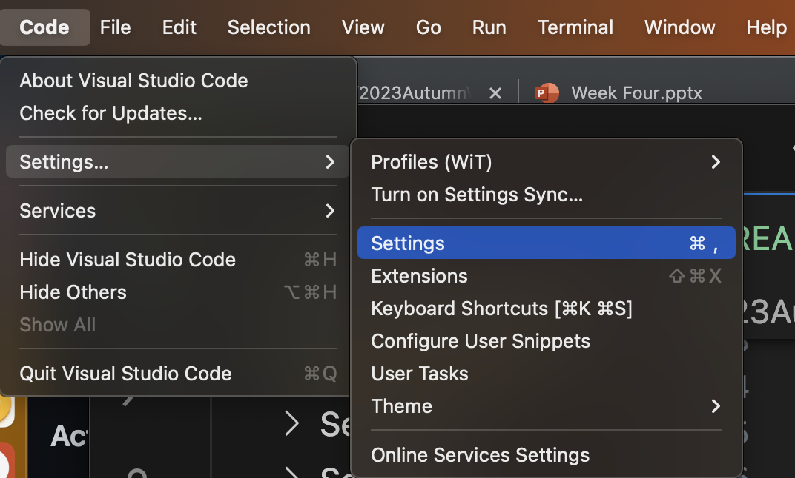
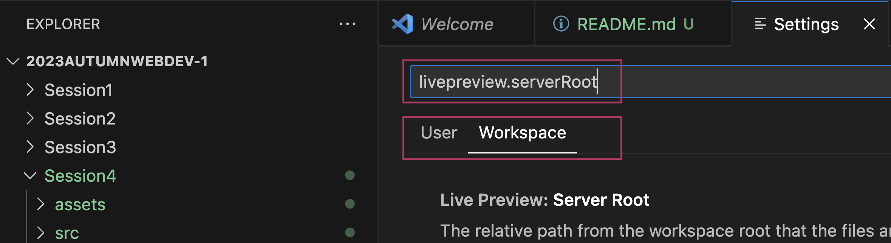

# Code Along Notes

## Initial Setup

* Create New Repo
  * Log in to [GitHub](https://github.com)
  * Create New Repo
    * Any Name, Make Public, Create `README.md`
        
  * Create new Action Pipeline to publish `./src`
    
    
    
    
    `Commit Changes`
* Clean VSCode Setup
  * Create new Profile (to ensure no extension or settings conflicts, etc)
    
  * Clone Repo via VS Code
* Setup `./src` folder
    * Basic `index.html`
* Setup VSCode Workspace
  * Install Extension
    * [Live Preview](https://marketplace.visualstudio.com/items?itemName=ms-vscode.live-server)
    * Open the `Settings`
      
    * Toggle to `Workspace` Settings and filter to `livePreview.serverRoot`
      
      Set to `./src`
    * This should create a new file `.vscode/settings.json` with the contents: 
      ```json
      {
          "livePreview.serverRoot": "./src"
      }
      ```
    * The LivePreview extension and published website should now work in the same way


## Setup Template with Wireframe CSS